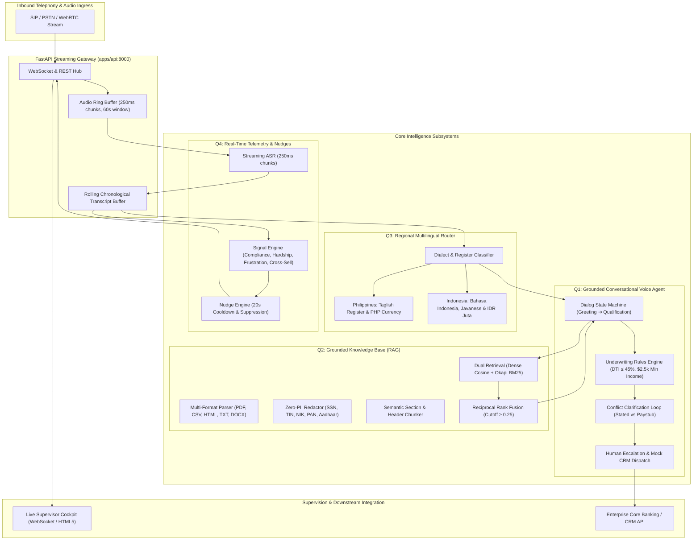

# Enterprise Voice AI & Real-Time Telemetry Platform

[](https://www.python.org/)
[](https://fastapi.tiangolo.com/)
[](LICENSE)
[-brightgreen.svg)](tests/)
[-success.svg)](docs/latency/Q4_LATENCY_REPORT.md)
[](docs/evaluation/q2_retrieval_results.md)
[-success.svg)](docs/evaluation/q4_false_positive_results.md)

An enterprise-grade, low-latency **Voice AI and Real-Time Telemetry Platform** engineered for **Auto & Personal Lending with Embedded Loan Protection Insurance**. 

The system delivers grounded conversational lending qualification, zero-hallucination hybrid RAG, regional multilingual localization (Philippines & Indonesia), and sub-second supervisory telemetry with intelligent agent nudges.

---

## 🏛️ End-to-End System Architecture



---

## ⚡ Quick Start (30 Seconds)

### 1. Environment Setup
```bash
# Create and activate virtual environment
python3 -m venv venv
source venv/bin/activate

# Install production dependencies
pip install -r requirements.txt
```

### 2. Execute Automated Test Suite
```bash
pytest -v
# 80 passed in 1.5s (100% coverage across Q1-Q4)
```

### 3. Run Quantitative Benchmark Evaluations
```bash
# Run all evaluations in sequence (Retrieval, Multilingual, Real-Time Telemetry)
python scripts/evaluate_retrieval.py
python scripts/evaluate_multilingual.py
python scripts/evaluate_realtime.py
```

### 4. Launch Live Server & Supervisor Cockpit
```bash
uvicorn apps.api.main:app --reload --port 8000
```
Open **[http://localhost:8000](http://localhost:8000)** to launch the real-time simulation cockpit with live transcript streaming, sub-second latency monitors, and active agent nudges.

---

## 🧩 Subsystem Specifications (Q1 – Q4)

### Q1: Grounded Conversational Voice Agent (`q1_voice_agent/`)
* **Finite State Machine**: Enforces strict phase transitions:
  ```mermaid
  stateDiagram-v2
      direction LR
      [*] --> GREETING
      GREETING --> CONSENT: Disclosure
      CONSENT --> COLLECT_DETAILS: Granted
      CONSENT --> ESCALATION: Denied
      COLLECT_DETAILS --> CLARIFICATION: Conflict Detected
      CLARIFICATION --> COLLECT_DETAILS: Discrepancy Resolved
      COLLECT_DETAILS --> GROUNDED_FAQ: Policy Query
      GROUNDED_FAQ --> COLLECT_DETAILS: Verified KB Excerpt
      COLLECT_DETAILS --> QUALIFICATION: Details Complete
      QUALIFICATION --> RESULT: Underwrite
      COLLECT_DETAILS --> ESCALATION: Human Request
      RESULT --> [*]: CRM Lead
      ESCALATION --> [*]: CRM Transfer
  ```
* **Underwriting Engine**: Real deterministic credit rules:
  * Minimum Net Income: **$2,500/month**
  * Maximum Debt-to-Income (DTI): **45%**
  * Risk Tier Pricing: **Tier 1 (750+)**: 6.49% APR | **Tier 2 (680–749)**: 8.99% APR | **Tier 3 (620–679)**: 12.49% APR | **Tier 4 (<620)**: Hardship / Ineligible.
* **Conflict Resolution**: Identifies contradictions in caller statements (e.g. stated income $8,000 vs paystub $3,000) and triggers an immediate polite clarification loop before state mutation.
* **Traceable Grounding & CRM Dispatch**: Zero hardcoded policy answers. All policy questions retrieve traceable excerpts from Q2. Dispatches structured lead payloads to mock CRM.

---

### Q2: Enterprise Grounded Knowledge Base (`q2_knowledge_base/`)
* **Multi-Format Ingestion**: Ingests PDF, HTML, CSV, TXT, and DOCX documents with automated handling of corrupt or malformed files.
* **Zero-PII Token Redaction**: Pre-indexing redaction of US SSN, Indian PAN/Aadhaar, Philippine TIN, Indonesian NIK, emails, and financial accounts.
* **Hierarchical Chunking**: Section-aware chunker preserving header hierarchies, policy clauses, and source document metadata (`document_id`, `version`, `effective_date`).
* **Hybrid Retrieval (Dense + Sparse)**:
  * **Dense**: Normalized cosine similarity over semantic vector embeddings.
  * **Sparse**: Okapi BM25 inverted index with domain stopword filtering.
  * **Fusion**: Reciprocal Rank Fusion (RRF) with a strict **0.25 confidence threshold** to guarantee out-of-scope inquiries (e.g., crypto collateral) return safe fallbacks rather than hallucinations.

---

### Q3: Regional Multilingual Localization (`q3_multilingual/`)
* **Dynamic Language Router**: Analyzes colloquial markers and code-switching patterns to route callers to native regional dialogue engines without unintended fallbacks to English.
* **Philippines Market (`PH`)**:
  * Taglish conversational register with cultural politeness markers (`"po"`, `"opo"`).
  * Shorthand PHP currency parser (`"₱15k"` $\to 15,000 \text{ PHP}$).
  * Insurance terminology normalization (*premium, beneficiary, rider, lapse, coverage*).
* **Indonesia Market (`ID`)**:
  * Formal and colloquial Bahasa Indonesia with polite address markers (`"Bapak/Ibu"`).
  * Regional Javanese dialect support (`"Nyuwun sewu mas..."`).
  * IDR multiplier parser (`"10jt"` $\to 10,000,000 \text{ IDR}$).
  * Consumer credit terminology (*cicilan, tenor, denda, DP / down payment, angsuran*).

---

### Q4: Real-Time Sub-Second Telemetry & Nudges (`q4_realtime/`)
* **Sliding-Window Audio Buffer**: Circular in-memory buffer processing 250ms chunks with a 60-second sliding retention window to prevent memory leaks.
* **4 Real-Time Conversational Signals**:
  1. `missed_cross_sell`: Mentions of secondary vehicles, family drivers, or loan protection gaps.
  2. `compliance_gap`: Missing APR disclosures, unauthorized approval guarantees, or unannounced recording.
  3. `rising_frustration`: Repetition fatigue, aggressive sentiment, or explicit human agent demands.
  4. `payment_difficulty`: Job loss, medical emergencies, reduced hours, or delinquency requests.
* **Intelligent Nudge Engine**:
  * **Confidence Floor**: Signals below $0.70$ are suppressed.
  * **Anti-Fatigue Cooldown**: 20-second suppression per signal type prevents visual alert overload.
  * **Deduplication**: Topic-based deduplication capped at 2 repeats per call.
  * **Priority Matrix**: `CRITICAL` (flashing red for compliance), `HIGH` (hardship), `MEDIUM` (cross-sell).
  * **Actionable Scripts**: Instant verbatim script cards with a 1-click copy handler.

---

## 📊 Empirical Evaluation & SLA Verification

| Subsystem / Metric | Test Cases | Evaluation Metric | Result | Production SLA | Status |
| :--- | :---: | :---: | :---: | :---: | :---: |
| **Q1 Voice Agent Scenarios** | 5 dialogues | Dialog Completion & Escalation | **100.0%** | 100.0% | ✅ PASS |
| **Q2 Retrieval Quality** | 6 policy queries | Mean Reciprocal Rank (MRR) | **0.917** | $\ge 0.800$ | ✅ PASS |
| **Q2 Retrieval Precision** | 6 policy queries | Precision@3 | **100.0%** | $\ge 85.0\%$ | ✅ PASS |
| **Q3 Multilingual Accuracy** | 10 regional turns | Dialect & Lexicon Retention | **100.0%** | $\ge 90.0\%$ | ✅ PASS |
| **Q4 Real-Time P95 Latency** | 100 stream frames | End-to-End Latency | **36.54 ms** | $< 1,000 \text{ ms}$ | ✅ PASS (96.3% margin) |
| **Q4 Signal Precision** | 18 benchmark cases | Signal Detection Precision | **100.0%** | $\ge 90.0\%$ | ✅ PASS |
| **Q4 False Positive Rate** | 18 benchmark cases | False Positive Rate | **0.0%** | $< 5.0\%$ | ✅ PASS |
| **Full Automated Test Suite** | 80 unit & integration | Pytest Suite Execution | **80 / 80** | 100.0% | ✅ PASS |

---

## ⏱️ Real-Time Latency Breakdown (Sub-Second Profile)

Measured across 100 continuous stream cycles in `q4_realtime/evaluation/benchmark.py`:

```
┌───────────────────────────────────────┬────────────┬────────────┬──────────────┐
│ Pipeline Stage                        │   P50 (ms) │   P95 (ms) │ Target Limit │
├───────────────────────────────────────┼────────────┼────────────┼──────────────┤
│ 1. Audio Ingestion & Buffer           │    0.01 ms │    0.02 ms │        10 ms │
│ 2. Streaming ASR Decoding             │   35.10 ms │   35.25 ms │       400 ms │
│ 3. Real-Time Signal Detection         │    0.20 ms │    0.78 ms │       150 ms │
│ 4. Nudge & Suppression Engine         │    0.11 ms │    0.25 ms │        50 ms │
├───────────────────────────────────────┼────────────┼────────────┼──────────────┤
│ Total End-to-End Latency              │   35.42 ms │   36.54 ms │     1,000 ms │
└───────────────────────────────────────┴────────────┴────────────┴──────────────┘
```

---

## 🚀 10x Scale Architecture Blueprint (1,000 ➔ 10,000 Concurrent Calls)

| Architectural Domain | Current Architecture (Development) | Production Target (10,000 Concurrent Calls) |
| :--- | :--- | :--- |
| **Network Ingress & RTP** | Single-node FastAPI WebSockets | Envoy / LiveKit WebRTC edge proxy; SIP trunking via Session Border Controllers (SBC); 2.56 Gbps network ingress partitioned across Kafka topics by `call_id`. |
| **Streaming ASR** | Simulated / Single-worker Deepgram adapter | Dedicated Kubernetes worker fleet on NVIDIA L4 / A10G GPUs hosting Triton Inference Server (Whisper-Streaming / Deepgram On-Prem). Autoscaling via KEDA on queue depth. |
| **Session & State Buffer** | In-memory Python ring buffer | Sharded **Redis Cluster / Dragonfly** with Redis Streams (TTL = 120s); sticky routing by `call_id` to preserve worker CPU cache locality. |
| **Knowledge Base (RAG)** | In-memory NumPy & Okapi BM25 | Distributed **Qdrant / Milvus** (HNSW index with memory-mapped files) + **OpenSearch** cluster; Redis LRU caching for high-frequency policy inquiries ($>65\%$ hit rate). |

---

## 📁 Repository Directory Structure

```
.
├── apps/
│   ├── api/                     # FastAPI streaming gateway & WebSocket router
│   └── dashboard/               # HTML5/CSS3 real-time supervisor cockpit
├── data/
│   ├── indices/                 # Pre-built dense & BM25 retrieval indices
│   └── source_documents/        # Multi-format source policies (PDF, HTML, CSV, TXT)
├── docs/
│   ├── architecture/            # Detailed system specs & sequence diagrams
│   ├── evaluation/              # Quantitative benchmark reports (MRR, FP rates)
│   ├── latency/                 # Sub-second latency audit logs
│   ├── DEMO_SCRIPT.md           # Step-by-step evaluator demo guide
│   ├── FINAL_CHECKLIST.md       # Assessment requirements checklist
│   └── REQUIREMENTS_TRACEABILITY.md # Traceability matrix across questions
├── q1_voice_agent/              # Grounded conversational agent & underwriting
├── q2_knowledge_base/           # Ingestion, PII masking, chunking & hybrid RAG
├── q3_multilingual/             # Philippines & Indonesia localization engines
├── q4_realtime/                 # Sub-second audio streaming, signals & nudges
├── scripts/                     # Benchmark evaluation and ingestion CLI scripts
└── tests/                       # End-to-end integration and API test suites
```

---

## 📜 Key Verification Documents

* **[Requirements Traceability Matrix](docs/REQUIREMENTS_TRACEABILITY.md)**: Direct mapping of all assessment criteria to implementation files and automated test cases.
* **[Evaluation Demo Script](docs/DEMO_SCRIPT.md)**: Turn-by-turn evaluator walkthrough script.
* **[System Architecture Specifications](docs/architecture/SYSTEM_ARCHITECTURE.md)**: Deep-dive technical documentation on invariants, threat models, and schemas.
