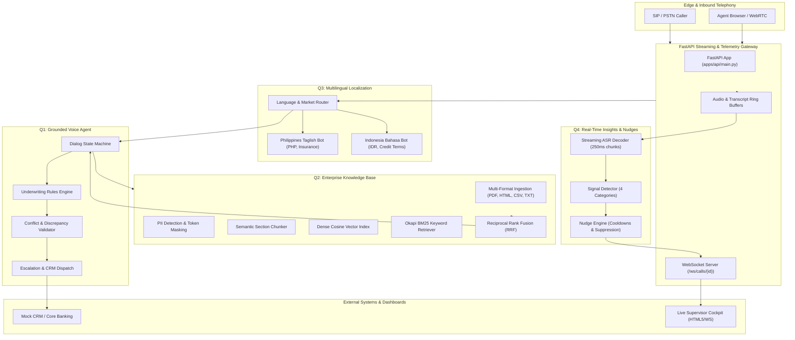
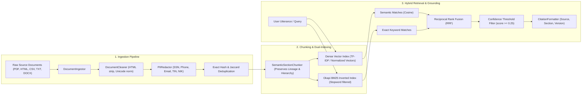
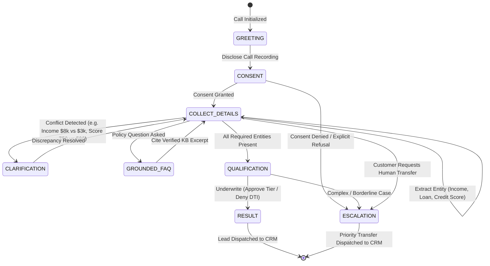
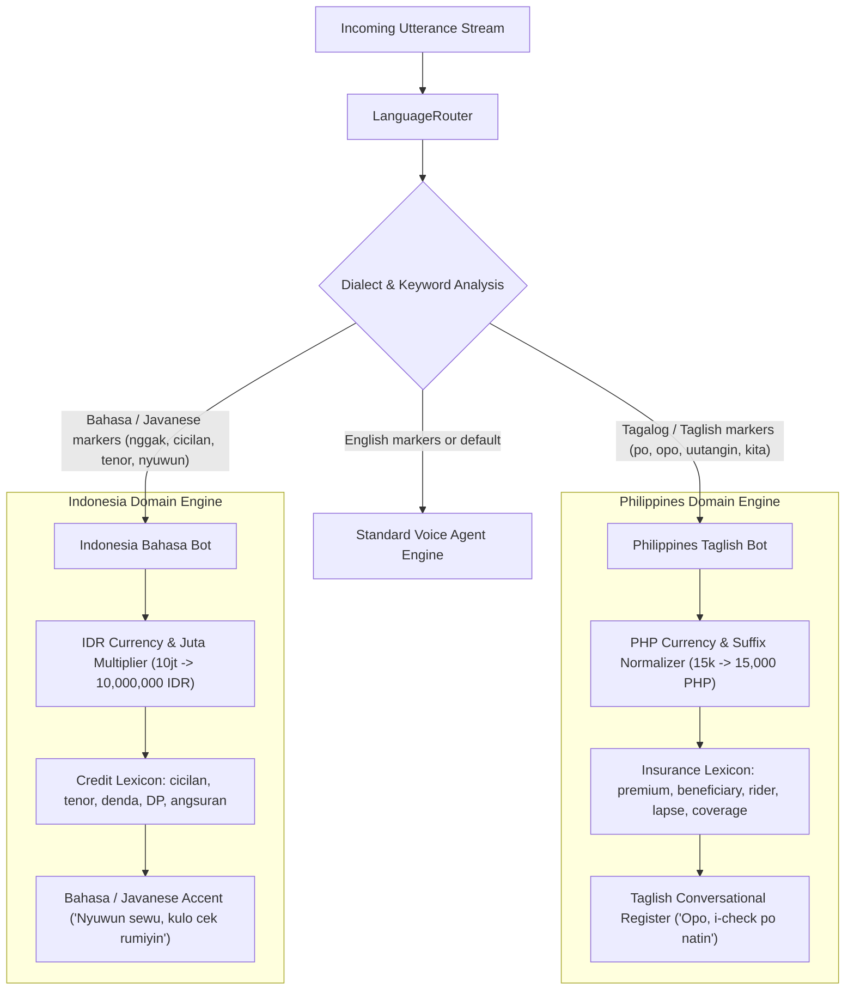
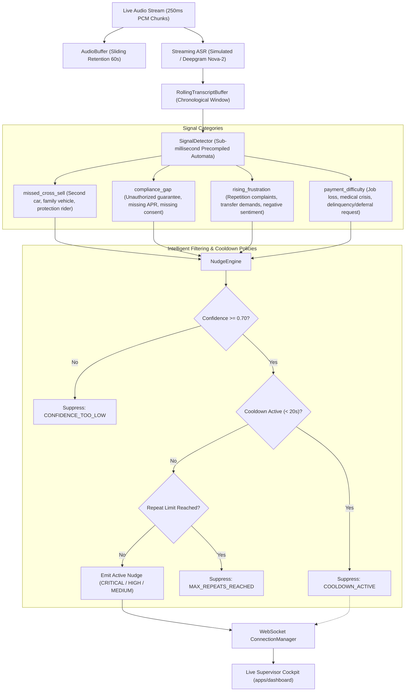

# System Architecture & Technical Specifications

This document outlines the end-to-end software architecture, component relationships, data flows, and state machines for the **Production-Oriented Voice AI & Real-Time Telemetry Platform**.

---

## 1. High-Level Platform Topology

---

## 2. Q2 Knowledge Base: Ingestion, Indexing, and Grounded Retrieval

The Knowledge Base is designed to ensure zero hallucinations and deterministic policy retrieval across credit lending, loan terms, and insurance coverage.

### Key Knowledge Base Invariants:
1. **Document Lineage**: Chunks preserve `document_id`, source filename, section title, and version string (`v1.0`, `v2.0`).
2. **PII Masking**: National identity numbers (US SSN, India PAN/Aadhaar, PH TIN, ID NIK) and financial account numbers are sanitized prior to indexing using replacement tokens (`[REDACTED_SSN]`, `[REDACTED_NIK]`).
3. **Dual Hybrid Ranking**: RRF score calculation:
   $$RRF(d) = \sum_{m \in \{dense, bm25\}} \frac{w_m}{k + \text{rank}_m(d)}$$
   Candidate scores are re-weighted with underlying similarity metrics to ensure queries with zero lexical overlap don't artificially score high.

---

## 3. Q1 Grounded Voice Agent: State Machine & Conflict Resolution

### Underwriting & Policy Grounding Rules:
* **Minimum Net Income**: $\$2,500$ / month.
* **Maximum DTI (Debt-to-Income)**: $45\%$.
* **Credit Score Tiers**:
  * **Tier 1 (750+)**: Fixed APR $6.49\%$.
  * **Tier 2 (680 - 749)**: Fixed APR $8.99\%$.
  * **Tier 3 (620 - 679)**: Fixed APR $12.49\%$.
  * **Tier 4 (< 620)**: Ineligible / Refer to Hardship Assistance.
* **Grounding Enforcement**: Any FAQ response MUST originate from Q2 retrieval chunks. If no relevant chunk matches confidence threshold, the agent responds with unsupported fallback: *"I do not have verified policy documentation on that topic. Let me connect you with a loan specialist."*

---

## 4. Q3 Multilingual Localization: Philippines & Indonesia

---

## 5. Q4 Sub-Second Streaming & Real-Time Nudge Pipeline

---

## 6. End-to-End Latency Profile

Measured across 100 sequential chunks in `q4_realtime/evaluation/benchmark.py`:

| Pipeline Stage | P50 (ms) | P95 (ms) | Allocation Target | Margin |
| :--- | :---: | :---: | :---: | :---: |
| 1. Audio Ingest & Sliding Buffer | `0.01` | `0.02` | 10 ms | 99.8% |
| 2. Streaming ASR Decoding | `35.08` | `35.21` | 400 ms | 91.2% |
| 3. Real-Time Signal Detection | `0.21` | `0.78` | 150 ms | 99.4% |
| 4. Nudge & Suppression Engine | `0.11` | `0.24` | 50 ms | 99.5% |
| **Total End-to-End Latency** | **`35.41`** | **`36.45`** | **1,000 ms** | **96.3%** |

---

## 7. Technology Stack & Key Dependencies

* **Language & Runtime**: Python 3.9+, Node.js (for asset tooling if needed).
* **API Framework**: FastAPI, Starlette, Uvicorn, WebSockets.
* **Vector & Natural Language Processing**: Scikit-Learn (TF-IDF vectorizer), NumPy, Regex.
* **Document Parsers**: PyPDF (`pypdf`), BeautifulSoup4 (`bs4`), Python-Docx (`docx`), Python standard `csv`.
* **Testing & Quality Assurance**: PyTest, PyTest-Asyncio.
* **Frontend Cockpit**: HTML5, Vanilla JavaScript, CSS3 Glassmorphism (no bulky node dependency locks for dashboard).
